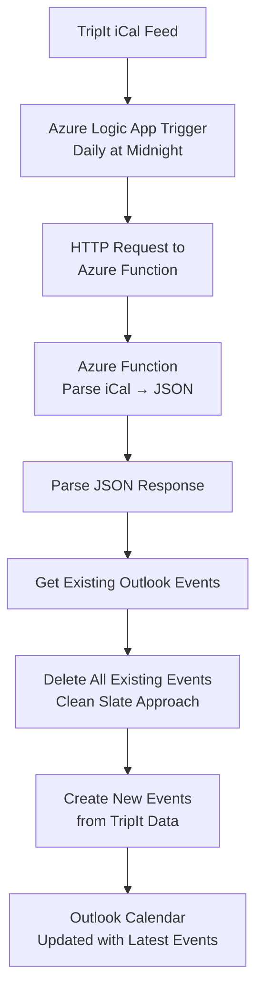

# TripItICalEventParser

A complete solution for synchronizing TripIt calendar events with Microsoft Outlook, consisting of an Azure Function for iCal parsing and an Azure Logic App for automated daily synchronization.

## Purpose

This project solves a specific integration challenge: **Microsoft Outlook cannot directly work with TripIt's default .ics format**. The solution provides a complete end-to-end automation that transforms TripIt iCal feeds into Outlook calendar events through a two-component architecture.

## Architecture Overview

The solution consists of two main components:

1. **Azure Function** (`ParseICalFeed`): Parses iCal feeds and converts them to JSON format
2. **Azure Logic App** (`tripit-outlook-sync`): Orchestrates the daily synchronization workflow

## Complete Integration Process

### End-to-End Workflow



### Detailed Step-by-Step Process

1. **Daily Trigger**: Azure Logic App automatically runs at midnight (W. Europe Standard Time)
2. **Fetch TripIt Data**: Logic App calls the Azure Function with your TripIt iCal feed URL
3. **Parse iCal Feed**: Azure Function downloads and parses the iCal feed, filtering events for the current year
4. **JSON Conversion**: Function returns structured JSON containing event details
5. **Parse Response**: Logic App validates and parses the JSON response
6. **Calendar Cleanup**: Logic App retrieves and deletes all existing events from the designated Outlook calendar
7. **Event Creation**: Logic App creates new Outlook events based on the parsed TripIt data
8. **Synchronization Complete**: Outlook calendar now contains all current TripIt events

This automated approach ensures TripIt events are synchronized daily into Outlook, providing a reliable integration solution that handles duplicates and keeps calendars up-to-date.

## Components

### 1. Azure Function - ParseICalFeed

The core parsing component that handles iCal to JSON conversion.

**Endpoint**: `GET /api/ParseICalFeed`

**Parameters**:
- `icalFeedUrl` (required): The URL of the iCal feed to parse (typically from TripIt)

**Response**: JSON array of `TripEvent` objects

**Example Request**:
```
GET /api/ParseICalFeed?icalFeedUrl=https://www.tripit.com/feed/ical/private/[YOUR-PRIVATE-KEY]/tripit.ics
```

**Example Response**:
```json
[
  {
    "eventTitel": "Flight to Berlin",
    "location": "Berlin Airport (BER)",
    "description": "Flight details: LH123 from Frankfurt to Berlin",
    "eventStart": "2024-03-15T10:30:00Z",
    "eventEnd": "2024-03-15T12:00:00Z"
  },
  {
    "eventTitel": "Hotel Check-in",
    "location": "Hotel Adlon, Berlin",
    "description": "Reservation confirmation: ABC123",
    "eventStart": "2024-03-15T15:00:00Z",
    "eventEnd": "2024-03-17T11:00:00Z"
  }
]
```

### 2. Azure Logic App - Daily Synchronization

The automation orchestrator that manages the end-to-end synchronization process.

**Location**: See `/LogicApp/` directory for complete template and documentation.

**Key Features**:
- **Automated Daily Execution**: Runs at midnight to ensure calendars stay synchronized
- **Clean Slate Approach**: Deletes existing events before adding new ones to prevent duplicates
- **Error Handling**: Built-in retry logic and error handling for reliable operation
- **Outlook Integration**: Direct integration with Microsoft Outlook/Office 365 calendars

**Configuration Requirements**:
- Azure Function URL and access key
- TripIt private iCal feed URL
- Outlook API connection setup
- Target calendar configuration

For detailed setup instructions, see [LogicApp/README.md](LogicApp/README.md).

## Quick Start

### Prerequisites

- Azure subscription
- TripIt account with private iCal feed access
- Microsoft Outlook/Office 365 account
- .NET 8.0 SDK (for local development)

### 1. Deploy Azure Function

1. **Clone and build the project**:
   ```bash
   git clone https://github.com/abeckDev/TripItICalEventParser.git
   cd TripItICalEventParser
   dotnet restore
   dotnet build
   ```

2. **Deploy to Azure**:
   ```bash
   func azure functionapp publish <YOUR-FUNCTION-APP-NAME>
   ```

3. **Test the function**:
   ```bash
   curl "https://your-function-app.azurewebsites.net/api/ParseICalFeed?code=YOUR-KEY&icalFeedUrl=YOUR-TRIPIT-URL"
   ```

### 2. Deploy Logic App

1. **Import the Logic App template**:
   - Navigate to Azure Portal → Logic Apps
   - Create new Logic App (Consumption tier)
   - Use Code view to import `/LogicApp/tripit-outlook-sync.json`

2. **Configure parameters**:
   - Update Azure Function URL and key
   - Set your TripIt iCal feed URL
   - Configure Outlook connection
   - Update calendar ID for your target calendar

3. **Enable and test**:
   - Enable the Logic App
   - Run manually to test the workflow
   - Monitor execution history for any issues

### 3. Get Your TripIt Feed URL

1. Log into TripIt.com
2. Go to Account Settings → Calendar Feeds
3. Copy your private iCal feed URL (format: `https://www.tripit.com/feed/ical/private/[YOUR-KEY]/tripit.ics`)

## Event Data Structure

Each event returned by the Azure Function contains the following properties:

- **eventTitel**: The title/summary of the event
- **location**: Event location information
- **description**: Detailed event description
- **eventStart**: Event start date and time (UTC)
- **eventEnd**: Event end date and time (UTC)

## Local Development

### Running the Azure Function Locally

1. **Install prerequisites**:
   ```bash
   # Install .NET 8.0 SDK
   # Install Azure Functions Core Tools v4
   ```

2. **Clone and setup**:
   ```bash
   git clone https://github.com/abeckDev/TripItICalEventParser.git
   cd TripItICalEventParser
   dotnet restore
   dotnet build
   ```

3. **Create local settings**:
   ```json
   // local.settings.json
   {
       "IsEncrypted": false,
       "Values": {
           "AzureWebJobsStorage": "UseDevelopmentStorage=true",
           "FUNCTIONS_WORKER_RUNTIME": "dotnet-isolated"
       }
   }
   ```

4. **Start the function**:
   ```bash
   func start --build
   ```

5. **Test locally**:
   ```bash
   curl "http://localhost:7071/api/ParseICalFeed?icalFeedUrl=YOUR-TRIPIT-URL"
   ```

### Testing the Logic App

For Logic App development and testing:
1. Use the Azure Portal Logic App Designer
2. Import the template from `/LogicApp/tripit-outlook-sync.json`
3. Configure all required parameters and connections
4. Test with "Run Trigger" functionality

## Monitoring and Troubleshooting

### Azure Function Monitoring
- **Application Insights**: Built-in telemetry and performance monitoring
- **Function Logs**: View execution logs in Azure Portal
- **Health Checks**: Monitor function availability and response times

### Logic App Monitoring
- **Run History**: Track execution status and identify failures
- **Workflow Analytics**: Monitor performance and success rates
- **Connection Status**: Verify Outlook API connectivity

### Common Issues
1. **Function Authorization**: Ensure correct function keys are used
2. **iCal Feed Access**: Verify TripIt feed URL is accessible
3. **Outlook Permissions**: Check Logic App has proper calendar access
4. **Calendar ID**: Ensure target calendar ID is correct and accessible

## Architecture Benefits

- **Separation of Concerns**: Function handles parsing, Logic App handles orchestration
- **Reliability**: Built-in retry mechanisms and error handling
- **Scalability**: Azure serverless architecture scales automatically
- **Maintainability**: Clear separation allows independent updates
- **Cost Efficiency**: Pay-per-use serverless model

## Dependencies

- **iCal.NET**: Library for parsing iCal format files
- **Microsoft.Azure.Functions.Worker**: Azure Functions runtime
- **Microsoft.ApplicationInsights**: Application monitoring and logging

## Acknowledgments

Thanks to the Team from [iCal.NET](https://github.com/ical-org/ical.net) for providing an easy to use and well documented way on how to deal with iCal files! 

## License

This project is licensed under the MIT License - see the [LICENSE](LICENSE) file for details.

## Contributing

Contributions are welcome! Please feel free to submit a Pull Request.

## Support

This is a specialized tool designed for TripIt-to-Outlook integration via Power Automate. For issues or questions, please open an issue on GitHub.
